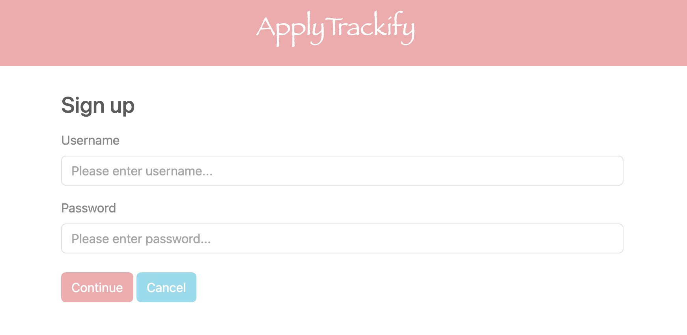
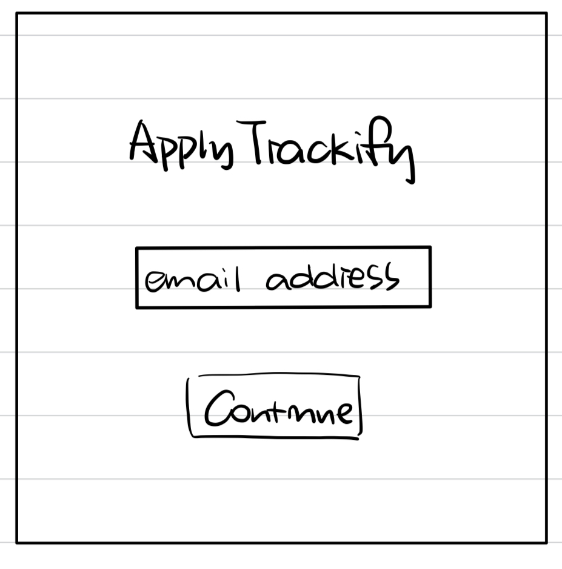
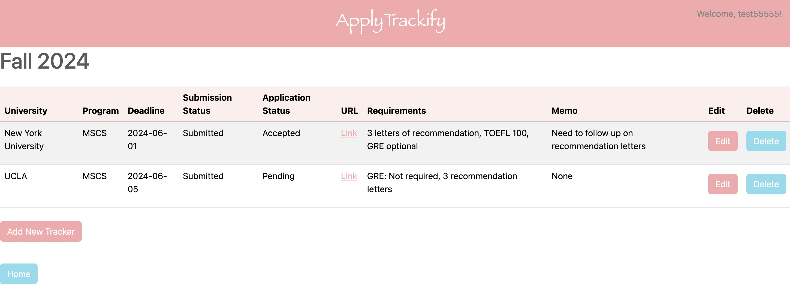

# ApplyTrackify

## Overview

ApplyTrackify is a web app that will allow users to keep track of multiple application lists. Users can register and login. Once they're logged in, they can see the closest deadlines and create or view their application list. For every list that they have, they can edit or delete the tracker table.

ApplyTrackify is designed to simplify the lives of users by providing them with a structured and intuitive interface to monitor the progress of their applications, deadlines, submission statuses, and any specific requirements or notes associated with each application. ApplyTrackify ensures that users can efficiently organize their application efforts, avoid missing critical deadlines, and maintain an overview of all necessary application components at a glance.

## Data Model

The application will store Users, Graduate Program Tracker Lists, and Graduate Program Trackers.

* users can have multiple graduate tracker lists (via references)
* each graduate tracker list can have multiple graduate trackers (via references)

An Example User:

```javascript
{
  username: "userExample",
  hash: // a password hash,
  email: "user@example.com", // user email
  graduateProgramTrackerLists: // an array of references to Graduate Program Tracker List documents
  slug: // using mongoose-slug-updater, slug:name 
}
```
An Example Graduate Program Tracker List:

```javascript
{
  user: // a reference to a User object
  name: "25Fall CS Master",
  graduateTrackers: // an array of references to Graduate Tracker documents
  slug: // using mongoose-slug-updater, slug:name 
}
```

An Example Graduate Program Tracker:

```javascript
{
  user: // a reference to a User object
  graduatetrackerList: // a reference to a Graduate Program Tracker List object
  university: "New York University",
  program: "MSCS",
  deadline: "2024-03-01", 
  submissionStatus: "Submitted", 
  applicationStatus: "Accepted",
  url: "https://apply.gsas.nyu.edu/apply/",
  requirements: "3 letters of recommendation, TOEFL 100, GRE optional", 
  memo: "Need to follow up on recommendation letters", 
}
```

## [Link to Commented First Draft Schema](db.mjs) 

## Wireframes

/login - page for login


/register - page for register


<!-- /dashboard/verify-email - page for email verification
 -->

/dashboard - the main page that the user can see after logging in, where the user can create new tracker lists and view existing lists
[add calendar component]


<!-- /dashboard/create - page for creating a new tracker list
[04/10: delete this page]
 -->

/dashboard/slug-for-list - page for showing specific tracker list


/dashboard/slug-for-list/slug-for-tracker/edit - page for editing specific tracker of specific tracker list


/dashboard/slug-for-list/create-tracker - page for creating a new tracker of specific tracker list


## Site map
[remove verify-email page and create-list page]


## User Stories or Use Cases

1. as non-registered user, I can register a new account
2. as a user, I can log in to the site
3. as a user, I can create a new tracker list 
4. as a user, I can view or rename or delete all of the tracker lists I've created
5. as a user, I can add graduate trackers to an existing graduate tracker list
6. as a user, I can see the recent deadline in the user's main page
7. as a user, I can edit or delete each trackers I created
8. as a user, I can use calendar compoenent to view all deadlines

## Research Topics

* (2 points) Bootstrap
    * Bootstrap is a popular front-end framework for developing responsive and mobile-first websites.
    * Bootstrap is chosen for its extensive component library and responsive design features, which significantly speed up the development process.
    * Possible candidate modules or solutions: The core Bootstrap framework for CSS and JavaScript components.
<!-- * (6 points) Nodemailer for Email Verification and Reminders
    * Nodemailer is a module for Node.js applications to send emails easily. It supports various transport methods, including SMTP, and can be integrated into server-side logic to automate the process of sending emails from within an application.
    * Nodemailer is chosen for its flexibility and ease of use in sending automated emails, such as reminders or notifications, directly from the server. 
    * I think it's a challenging library to learn, so I've assigned it 5 points.
    * Possible candidate modules or solutions: nodemailer as the primary module for email sending functionality. -->
* (2 points) Moment.js
    * Moment.js is a widely used library in JavaScript that provides a multitude of options for parsing, validating, manipulating, and formatting dates.
    * The choice of Moment.js is based on its robust feature set that simplifies date-related operations, which can often be complex due to the inconsistencies across different locales and time zones.
* (3 points) SweetAlert
    * SweetAlert is a versatile and aesthetically pleasing replacement for JavaScript's alert boxes, which allows for more interactive and visually engaging notifications and prompts on web pages.
    * It is chosen for its ease of integration, customization options, and ability to enhance user interaction without reloading or navigating away from the current page, which improves user experience significantly.
    * Possible candidate modules or solutions: SweetAlert2 library for enhancing form submissions, confirmations, and alert functionality with custom modal popups.
* (3 points) FullCalendar
    * FullCalendar is a powerful and fully-featured JavaScript calendar library that enables the integration of interactive calendars into web applications. It supports events, drag-and-drop, views customization, and interacts seamlessly with different data sources.
    * This library is selected for its comprehensive API and broad browser compatibility, making it ideal for implementing complex calendar features with minimal setup.
    * Possible candidate modules or solutions: FullCalendar JavaScript library to display and manage events in a variety of calendar views such as daily, weekly, monthly, or agenda.

10 points total out of 10 required points 


## [Link to Initial Main Project File](app.mjs) 

## Annotations / References Used

1. [moment.js](https://momentjs.com/)
<!-- 2. [Nodemailer](https://www.nodemailer.com/about/) -->
2. [SweetAlert](https://sweetalert2.github.io/)
3. [Bootstrap](https://getbootstrap.com/)
4. [Bootstrap theme build](https://bootstrap.build/themes)
5. [FullCalendar](https://fullcalendar.io/)
